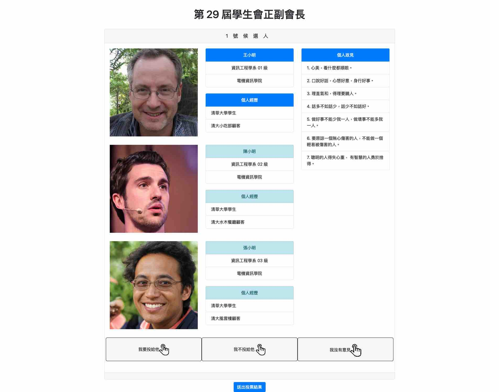

# Voting-DSA

清大學生會首個線上投票系統上線啦～

2020 年新型冠狀病毒全球大流行，為了減少人與人之間的接觸、保持社交距離，選委會決定將過往實體投票的選舉改為線上選舉，因此委託學生會資訊部開發，並且順利完成第 29 屆學生會正副會長、學生議會學生議員之選舉。

此專案歡迎各界高手幫忙開發貢獻，也歡迎其他學生自治組織使用這套投票系統，如果有好點子、改善建議也都相當歡迎提出 issue。

## Install & Run

1. `npm install`
2. `npm run dev`

## import sample data

- `mongorestore --drop --host localhost --port 27017 -uroot -ppassword --db voting_sa README/dump`

## 操作畫面

