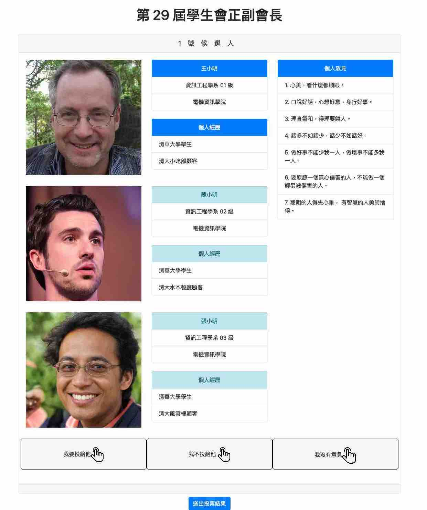
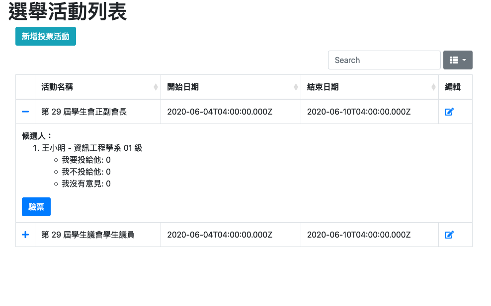
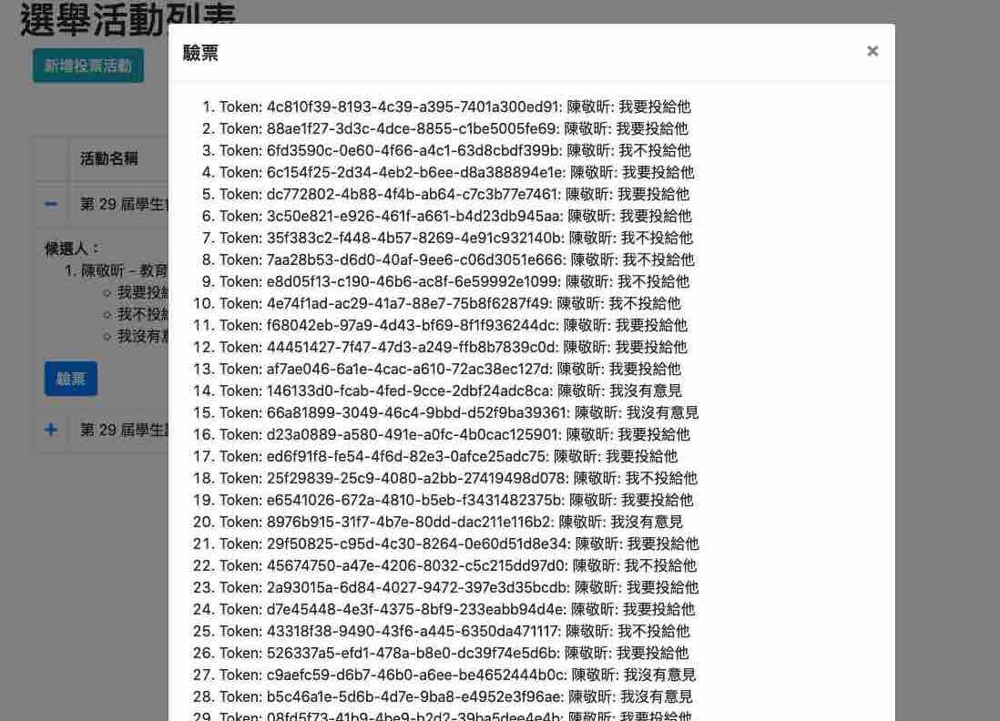

# Voting-DSA

清大學生會首個線上投票系統上線啦～

2020 年新型冠狀病毒全球大流行，為了減少人與人之間的接觸、保持社交距離，選委會決定將過往實體投票的選舉改為線上選舉，因此委託學生會資訊部開發，並且順利完成第 29 屆學生會正副會長、學生議會學生議員之選舉。

此專案歡迎各界高手幫忙開發貢獻，也歡迎其他學生自治組織使用這套投票系統，如果有好點子、改善建議也都相當歡迎提出 issue。

## 操作畫面

- [投票教學影片](https://www.youtube.com/watch?v=SN2JP758dFA&feature=youtu.be)







## 安裝、執行

1. `npm install`
1. `cp .env.dev .env`
1. `npm run dev`

## 開發

- 在 [README/postman](README/postman) 中有 API 測試範本
  - 記得改 `service_token`，產生方式如下
- 如何關閉 OAuth，啟用學號模擬？
  - `cp .env.dev`
  - 將 **For development** 中的註解拿掉
  - 在網頁中登入後，開啟瀏覽器命令列輸入 `jwtToken` 即可獲得
- 如何從本機產生登入 JWT Token?
  - 先透過 `addUser` API 建立使用者，並取得 `_id` 與 `student_id`
  - 打開 Node.js CLI 輸入以下程式碼產生 Token
  - 將 Token 直接貼到瀏覽器 cookie 中 `service_token` 欄位

```javascript
auth = require('./libs/ccxpAuth.js');
user = {"_id": "5ed699efdc02ue515d79627b","student_id": "108060001"}
auth.obtainServiceToken('108060001', user);
```

## 匯入測試檔案

- `mongorestore --drop --host localhost --port 27017 -uroot -ppassword --db voting_sa README/dump`

## 指派使用者為管理員
  ```bash
    mongo

    use DATABASE_NAME
    
    db.TABLE_NAME.update({student_id:'{YOUR_STUDENTID}'}, {$set: {"remark":"admin"}})

  ```

## 新增投票活動步驟

1. 透過 Postman 新增管理員（addUser）

   ```json
   {
     "student_id": "108062001",
   }
   ```

   加上 admin 權限

   ```json
   {
     "student_id": "108062001",
     "remark": "admin"
   }
   ```

   

1. 透過 Postman 新增活動（addActivity）

    ```json
    {
        "name": "第 30 屆學生會正副會長",
        "type": "candidate",
        "rule": "choose_all",
        "open_from": "2020/06/28 12:00:00",
        "open_to": "2020/06/30 12:00:00"
    }
    ```

    ```json
    {
        "name": "第 30 屆學生議員",
        "type": "candidate",
        "rule": "choose_all",
        "open_from": "2020/06/28 12:00:00",
        "open_to": "2020/06/30 12:00:00"
    }
    ```

    會返回類似於下面的資訊，請把 `_id` 記下來。

    ```json
    {
        "users": [],
        "options": [],
        "_id": "60dea866076f71776b9da13b",
        "name": "第 30 屆學生會正副會長",
        "type": "candidate",
        "rule": "choose_all",
        "created_at": "2021-07-02T05:47:18.861Z",
        "updated_at": "2021-07-02T05:47:18.861Z",
        "open_from": "2020-06-28T04:00:00.000Z",
        "open_to": "2020-06-30T04:00:00.000Z",
        "__v": 0
    }
    ```

    ```json
    {
        "users": [],
        "options": [],
        "_id": "60dea866076f71776b9da13c",
        "name": "第 30 屆學生議員",
        "type": "candidate",
        "rule": "choose_all",
        "created_at": "2021-07-02T05:47:18.861Z",
        "updated_at": "2021-07-02T05:47:18.861Z",
        "open_from": "2020-06-28T04:00:00.000Z",
        "open_to": "2020-06-30T04:00:00.000Z",
        "__v": 0
    }
    ```

1. 新增選舉人（addOption）

   記得把 `activity_id`、`avatar_url` 換掉

    - 會長參選人
    ```json
    {
      "activity_id": "60dea866076f71776b9da13b",
      "type": "candidate",
      "candidate": {
        "name": "王小明",
        "department": "人文社會學院學士班 20 級",
        "college": "人文社會學院",
        "avatar_url": "https://imgur.com/xxxxx.jpg",
        "personal_experiences": [
          "國立清華大學105學年度下學期-書卷獎"
        ],
        "political_opinions": [
          "1. 履行會長之職責。",
          "2. 持續關注學生感興趣的校內議題。"
        ]
      },
      "vice1": {
        "personal_experiences": [
          "國立清華大學轉學生聯誼會-活動"
        ],
        "name": "陳小明",
        "department": "科技管理學院學士班 22 級",
        "college": "科技管理學院",
        "avatar_url": "https://imgur.com/xxxxx.jpg"
      },
      "vice2": {
        "personal_experiences": [
          "國立清華大學學生會第29屆秘書部-部員"
        ],
        "name": "劉曉明",
        "department": "教育與學習科技學系 24 級",
        "college": "教育學院",
        "avatar_url": "https://imgur.com/xxxxx.jpg"
      }
    }
    ```
    - 議員參選人
    ```json
    {
      "activity_id": "60dea866076f71776b9da13c",
      "type": "candidate",
      "candidate": {
        "name": "陳小明",
        "department": "科技管理學院學士班 23 級",
        "college": "科技管理學院",
        "avatar_url": "https://imgur.com/xxxxxx.jpg",
        "personal_experiences": [
          "國立清華大學第 28 屆學生會秘書部部員",
          "國立清華大學第 29 屆學生議會秘書長"
        ],
        "political_opinions": [
          "1. 履行議員之職責。",
          "2. 持續關注學生感興趣的校內議題。"
        ]
      }
    }
    ```

1. 到後台檢查名稱、日期（UTC+0）是否正確
   - http://127.0.0.1:3000/activity.html

1. 修改 `libs/全校在學學生資料.csv`，這是可以投票的學生名單

## TODO 111-2

- [ ] 新增編輯投票人名單 UI
- [ ] 新增選舉活動、候選人增修查改 UI
- [ ] 將介面「我不投給他」改成「反對」
- [ ] 介面增加**一人多票**的說明
- [ ] 候選人增加一欄「參選執行長意願」
- [ ] 完善 README.md

---

- [ ] 加入登入跳轉到原先頁面
- [ ] 加入 debug、log
- [ ] 加入後台投票統計圓餅圖
- [ ] 加入自動化測試
- [ ] 修正投票按鈕點選範圍
- [ ] 重構前端程式碼
